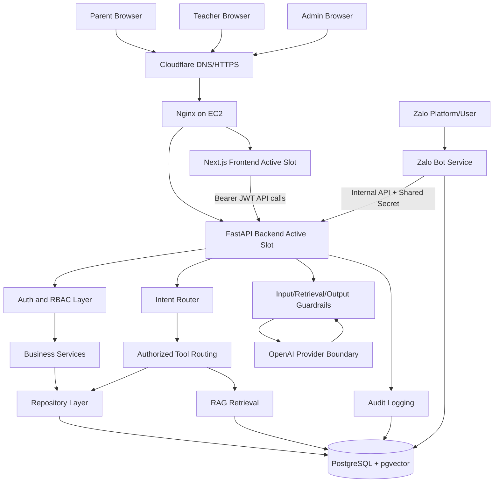
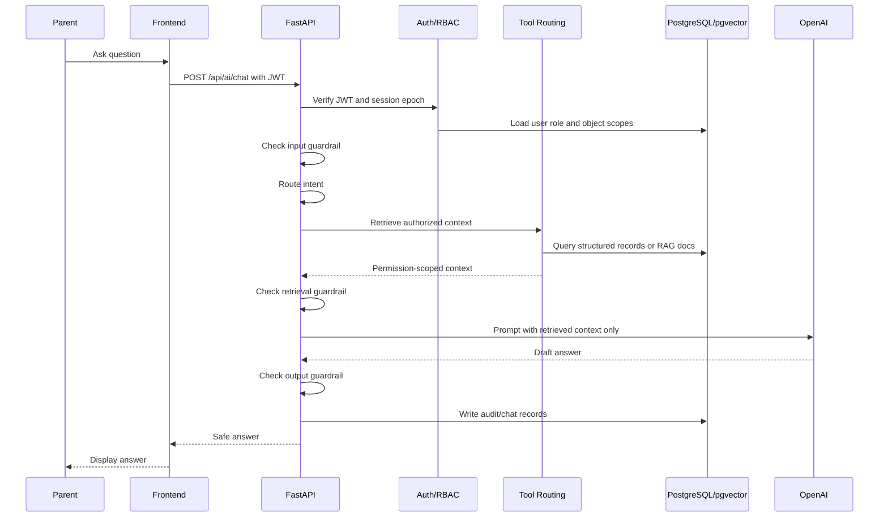
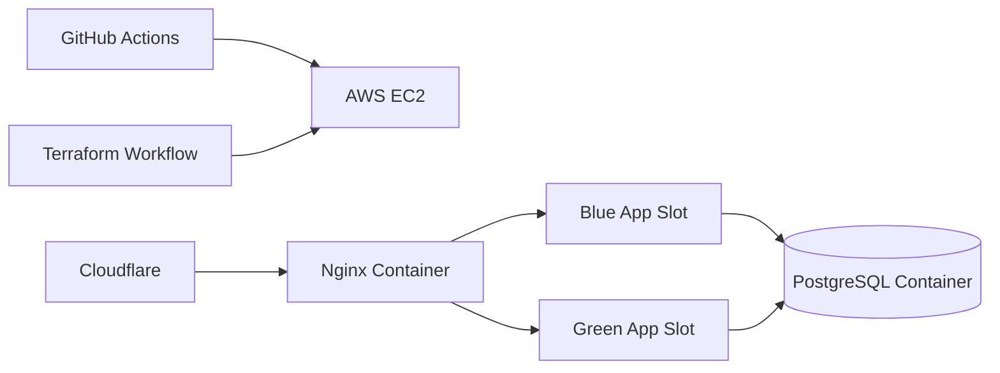

# C2-APP-129 Architecture Document

## 1. Executive Summary

C2-APP-129, currently named **English Learning Center Parent AI Assistant**, is a web application that helps parents understand, monitor and support their children's English learning journey at an English Learning Center. The product is not a general K-12 school management system, and it is not an AI homework-solving assistant.

The current architecture is suitable for a production MVP: a monorepo with a Next.js frontend, FastAPI backend, PostgreSQL + pgvector, OpenAI-first AI provider boundary, Zalo bot service, Docker Compose, Nginx reverse proxy, Cloudflare edge, GitHub Actions CI/CD and Terraform-managed AWS EC2 infrastructure. The architectural core is **Single Agent + Tool Routing**: the backend authenticates the user, enforces RBAC and object-level access, retrieves authorized context, builds the prompt from filtered context, calls the LLM, validates the response with guardrails and only then returns the answer.

The most important architecture decision is to make the backend the trust boundary. The LLM cannot access the database, cannot decide permissions and must not invent student records, schedules, policies or grades. This improves safety and auditability for sensitive parent/student data while preserving a clear scale path through managed PostgreSQL, caching, queues, service separation and horizontal scaling when traffic increases.

## 2. System Overview

### Product Scope

The system serves three primary user groups:

- **Parent**: views data for linked students and asks the AI about English learning progress, strengths, weaknesses, attendance, assessments, teacher feedback and center policies.
- **Teacher**: manages assigned classes, attendance, assessments, questions, student answers, grades and parent-facing insights.
- **Admin**: manages users, roles, students, parents, teachers, classes, parent-student links, teacher-class links, RAG documents and Zalo integration.

### Current Codebase Shape

- `src/apps/frontend`: Next.js 15, React 19, TypeScript, Tailwind CSS.
- `src/apps/backend`: FastAPI, SQLAlchemy, JWT auth, RBAC, repository/service layer, AI orchestration, RAG.
- `src/apps/zalo-bot-service`: Node.js/TypeScript service for Zalo integration.
- `src/docs`: architecture, security, database and deployment documentation.
- `deploy/ec2`: Docker Compose production, Nginx config, blue/green upstreams.
- `.github/workflows`: CI, Terraform infra, AWS EC2 deploy.

### Key Architectural Principle

The backend is the source of truth for authentication, authorization, retrieval and guardrails. The frontend only displays permission-scoped responses returned by the backend.

## 3. Business Requirements

1. Parents must be able to sign in securely and view only information for students explicitly linked to their account.
2. Parents must be able to ask about English learning progress, attendance, assessments, scores, teacher feedback, courses and center policies.
3. The AI assistant must respond in parent-friendly language and should answer in Vietnamese when the parent asks in Vietnamese.
4. The AI assistant must not solve homework, generate submit-ready answers or write student submissions.
5. Teachers must be able to manage assigned class data, including attendance, assessments, questions, student answers, grades and feedback.
6. Admins must be able to manage center operations: users, classes, courses, data relationships and documents.
7. The system must be deployable as a cost-conscious MVP while keeping a clear upgrade path to managed/cloud-native infrastructure.

### Assumptions

Some original project inputs are still placeholders. This document uses the following assumptions based on the current codebase:

- MVP traffic: hundreds to a few thousand parents per day, with low to moderate initial concurrency.
- Important data: parent/student PII, scores, attendance, assessment answers, teacher feedback, audit logs and Zalo identifiers.
- Realtime: not required for the main web application; the Zalo bot needs near-realtime message handling through a webhook/polling-style service.
- AI/LLM: required. OpenAI is the primary provider, with Claude/local LLM compatibility designed for future expansion.
- Payment: out of scope for the current product.
- RBAC and audit logging: required.
- MVP budget: low to medium, favoring EC2 + Docker Compose over Kubernetes.

## 4. Functional Requirements

### Parent Features

- Sign in with email/password and receive a backend-issued JWT.
- View the list of linked students.
- View each student's dashboard: level, class, progress, skill scores, attendance and assessment summary.
- Chat with the AI about progress, attendance, assessments, teacher comments, center policies and home-support guidance.
- Receive parent-friendly analysis of already-submitted answers without receiving replacement answers.
- Link a Zalo channel to receive or ask for information when the feature is enabled.

### Teacher Features

- View assigned classes.
- View students in assigned classes.
- Record attendance.
- Create/import assessments, questions, rubrics and printable assessment views.
- Enter or import student answers.
- Grade answers, use assisted auto-scoring, generate AI insights and approve parent-facing insights.

### Admin Features

- Manage users, teachers, parents and students.
- Create classes, teacher-class links and parent-student links.
- Manage RAG documents: policies, FAQ, handbook, announcements and course descriptions.
- Manage Zalo bot status and view message logs.

### AI Features

- Intent routing for core intents: `student_progress`, `assignment_status`, `schedule`, `center_policy`, `teacher_contact`, `general_parent_support`, `student_answer_analysis`, `assessment_summary`, `attendance_summary`, `course_information`.
- Authorized context retrieval before any LLM call.
- RAG only for approved unstructured documents.
- Structured student records retrieved from PostgreSQL through repositories/services.
- Input, retrieval and output guardrails.
- Bounded chat session history.

## 5. Non-functional Requirements

### Performance

- MVP target: normal non-AI APIs should respond in roughly 300-800 ms; AI chat depends on the provider, and the current timeout is 45 seconds.
- Dashboard endpoints should aggregate data in the backend to reduce frontend round trips.
- RAG search uses pgvector inside PostgreSQL, which is appropriate for the MVP. If the document corpus grows significantly, consider a dedicated vector database or search service.
- Indexes are required for common lookup keys: `user.email`, parent-student links, teacher-class links, `student_id`, `class_id`, assessment/question/answer foreign keys and Zalo sender IDs.

### Scalability

The current strategy is vertical scaling first: a single EC2 instance running Docker Compose with blue/green slots. This is simple, cost-effective and operationally manageable for the MVP.

Alternatives:

- Vercel frontend + Railway backend + managed PostgreSQL: less operational work and fast launch, but more platform dependency and careful network/secrets configuration.
- AWS ECS/Fargate + RDS + ElastiCache: better scalability and stronger production operations, but higher cost and complexity.
- Kubernetes: highly flexible, but overkill for a small-team MVP.

Trade-off: EC2 Compose is inexpensive and easy to debug, but it limits horizontal scaling, high availability and backup automation. When concurrency grows or downtime becomes unacceptable, the first upgrade should be managed PostgreSQL, followed by moving app containers to ECS/Fargate or Kubernetes.

### Availability

- Blue/green deployment reduces application release downtime.
- Cloudflare provides HTTPS edge termination and DNS proxying.
- Nginx routes traffic to the active slot.
- PostgreSQL currently runs as a container on the same host, so it remains a single point of failure.

The MVP availability target can reasonably be 99.0-99.5%. Reaching 99.9% or higher requires a managed database, multi-AZ design, external backups, strong health checks and auto-recovery.

### Security

- Backend-issued JWTs with `APP_SECRET_KEY` and `APP_SESSION_EPOCH`.
- Server-side RBAC and object-level access.
- Parents can access only linked students; teachers can access only assigned classes; admins have authenticated administrative privileges.
- The LLM cannot access the database and cannot decide permissions.
- CORS is restricted by `FRONTEND_URL`, with local origins allowed only in development.
- Secrets live in GitHub Secrets/hosting secrets; `.env` files must not be committed.
- Guardrails block prompt injection, submit-ready homework answers, context injection and sensitive output.

### Maintainability

- The monorepo makes it easier for developers to run the full system and keep contracts aligned.
- The backend is already separated into clear layers: routes, security, repositories, services, AI provider, RAG and guardrails.
- Business rules should remain in services/repositories and should not be pushed into prompts.
- Standard migration tooling such as Alembic should be added instead of relying on seed/table creation for production.

### Observability

- The system currently has an audit log model and Docker logs.
- Structured logging should be standardized for API requests, authorization decisions, selected intents/tools, retrieval sources, AI latency and guardrail decisions.
- Metrics and alerting should be added for API error rate, latency, OpenAI failures, DB health, disk usage, CPU/memory, failed deployments and Zalo bot disconnections.

## 6. High-level Architecture

The system uses a modular monolith for the backend, with the frontend and Zalo integration separated into their own services. The FastAPI backend acts as the application core and policy enforcement point.

Why choose a modular monolith for the backend:

- The domain is still changing quickly during the MVP phase.
- The team can maintain one codebase and one transaction boundary more easily.
- RBAC, retrieval and AI orchestration need consistent enforcement.
- Operational cost is lower than with microservices.

The main alternative is a domain-based microservice architecture, for example auth-service, student-service, assessment-service and ai-service. That approach scales individual modules more independently but increases network overhead, auth propagation complexity, tracing requirements, deployment complexity and data consistency risk. At the current scale, the modular monolith is the better fit.

## 7. Architecture Diagram

## 8. Main Components

### Frontend - `src/apps/frontend`

Responsibilities:

- Role-based UI for parent, teacher, admin and student surfaces.
- Login page and JWT storage/client API calls.
- Parent dashboard and AI chat workspace.
- Teacher assessment, attendance and grade workflows.
- Admin user/class/Zalo management screens.

Why Next.js:

- Strong TypeScript support, routing, SSR/static capabilities and mature deployment options.
- Fits current team and Tailwind-based UI.

Trade-off:

- Client-side localStorage token handling is simple but exposes tokens to XSS risk. For stronger production security, consider httpOnly secure cookies with CSRF protection.

### Backend API - `src/apps/backend`

Responsibilities:

- Authentication and JWT verification.
- RBAC and object-level authorization.
- REST API for dashboards, assessments, attendance, scores, documents and Zalo integration.
- AI chat orchestration and guardrails.
- Repository/service layer for PostgreSQL.

Why FastAPI:

- Fast development speed, Pydantic schemas, OpenAPI docs, async-compatible ecosystem and good fit for AI orchestration.

Trade-off:

- Python app scale depends on worker/process configuration and DB pooling. For high throughput, run multiple workers/containers and add cache/queue.

### AI Orchestration

Components:

- `intent_router.py`: rule-first routing with OpenAI fallback.
- `tools.py`: retrieves authorized context.
- `guardrails.py`: deterministic checks for input, retrieval context and output.
- `ai_provider.py`: provider boundary for OpenAI now and Claude/local later.
- `assessment_insights.py`: generates parent-facing assessment insights.

Decision:

- Use Single Agent + Tool Routing, not multi-agent. This is easier to audit, easier to secure and aligns with product requirement.

### PostgreSQL + pgvector

Responsibilities:

- Structured operational data.
- RAG document chunks and embeddings.
- Audit logs.
- Zalo link/message/session data.

Why PostgreSQL:

- Strong relational integrity for RBAC relationships and student records.
- pgvector is enough for MVP RAG without another data store.

Trade-off:

- Running PostgreSQL in Docker on EC2 is cost-effective but not ideal for HA/durability. Managed PostgreSQL should be the first infrastructure upgrade.

### Zalo Bot Service - `src/apps/zalo-bot-service`

Responsibilities:

- Manage Zalo session/adapter.
- Resolve link sessions and messages.
- Communicate with backend over internal network with shared secret.

Why separate service:

- Zalo adapter/session concerns are operationally different from core API.
- Node.js ecosystem may fit Zalo libraries better.

Trade-off:

- Adds another runtime and deployment unit. Internal auth, health checks and logs must be maintained.

### Nginx + Cloudflare

Responsibilities:

- Route `/api/*`, `/docs`, `/openapi.json` to backend.
- Route remaining traffic to frontend.
- Switch active blue/green upstream.
- Cloudflare handles public DNS and HTTPS edge.

Trade-off:

- Simple and cheap. However, no managed load balancer or multi-instance failover yet.

## 9. Data Flow

### Parent AI Chat Flow

### Teacher Assessment Flow

1. Teacher logs in and receives JWT.
2. Backend resolves assigned class IDs.
3. Teacher creates/imports assessment for an assigned class.
4. Backend validates teacher-class access before write.
5. Student answers are stored in `student_answers`.
6. Scoring/analysis uses retrieved question, rubric, answer and authorized class/student context.
7. Parent-facing insight is generated and may be approved before shown.

### RAG Flow

1. Admin creates/uploads approved document.
2. Backend chunks content and creates embeddings.
3. Chunks are stored in `document_chunks` with metadata and pgvector embedding.
4. During chat, RAG is only invoked for unstructured document intents.
5. Retrieved chunks pass visibility and guardrail checks before prompt construction.

## 10. Database Design

### Main Entity Groups

**Identity and RBAC**

- `users`: identity, email, full name, role, password hash, active flag.
- `parents`, `teachers`: profile tables.
- `students`: learner profile, optional linked user account.
- `parent_student_links`: object-level parent access.
- `teacher_class_links`: object-level teacher access.

**Learning Operations**

- `courses`: course metadata and objectives.
- `classes`: class schedule/location/course.
- `enrollments`: student-class membership.
- `attendance_records`: attendance by date/class/student.
- `skill_scores`: reading/listening/speaking/writing/grammar/vocabulary scores.
- `teacher_feedback`: parent-visible teacher comments.

**Assessment**

- `assessments`: assessment metadata, date, duration and lockdown settings.
- `assessment_questions`: prompts, type, choices, expected answer, skill tag, max score, rubric criteria.
- `student_answers`: submitted answers and teacher feedback.
- `assessment_attempts`: student attempt state and violation count.
- `assessment_attempt_events`: lockdown/activity events.
- `answer_analyses`: parent-facing analysis of submitted answers.
- `ai_insights`: generated insights, retrieved context and safety notes.

**RAG**

- `documents`: source document content and type.
- `document_chunks`: chunk text, metadata and vector embedding.

**Integrations and Audit**

- `zalo_link_sessions`, `student_channel_links`, `zalo_messages`, `zalo_bot_sessions`.
- `audit_logs`: sensitive reads/actions.

### Database Design Decisions

Structured student records must remain relational because they need strong ownership checks, joins and transactional integrity. RAG is reserved for unstructured center documents only. This separation prevents accidental retrieval of student records through vector search and keeps authorization auditable.

Alternative:

- Store all content in a vector store and retrieve semantically. This is simpler for AI UX but unsafe for student privacy and difficult to audit.

Scale considerations:

- Add indexes for all foreign keys and high-cardinality filters.
- Add vector indexes such as HNSW/IVFFlat when document chunks grow.
- Add read replicas only after query patterns are measured.
- Use Alembic migrations for controlled schema changes.
- Use PITR backups for production.

## 11. API Design

### API Style

The backend exposes REST APIs under `/api`. FastAPI/Pydantic provides request/response validation and OpenAPI documentation.

### Endpoint Groups

- Auth: `/api/auth/login`, `/api/auth/register`, `/api/dev/login`.
- Current user: `/api/me`.
- Parent/student: `/api/students/my-children`, `/api/students/{student_id}`, `/api/students/{student_id}/dashboard`.
- Student assessment taking: `/api/student/assessments`, `/api/student/assessments/{assessment_id}`, attempts and submit endpoints.
- Teacher/class: `/api/teacher/classes`, `/api/classes/{class_id}/dashboard`, attendance and student lists.
- Assessment management: `/api/assessments`, `/api/classes/{class_id}/assessments`, questions, imports, OCR drafts, submissions.
- Scores/insights: `/api/students/{student_id}/scores`, `/api/students/{student_id}/assessment-summary`, `/api/students/{student_id}/ai-insights`.
- AI: `/api/ai/chat`, `/api/ai/chat/session`.
- Documents/RAG: `/api/documents`, `/api/documents/ingest-folder`, `/api/rag/search`.
- Admin: `/api/admin/users`, teachers, parents, students, classes and links.
- Zalo: `/api/integrations/zalo/*`, `/api/admin/zalo/*`.

### API Decisions

REST is appropriate because most operations are CRUD/workflow-oriented and need clear permission boundaries. GraphQL could reduce over-fetching but would complicate object-level authorization and query cost control. For this system, REST with purpose-built dashboard endpoints is safer and simpler.

API should fail closed:

- Missing/invalid token returns 401.
- Valid user without role/object access returns 403.
- Ambiguous parent student target returns 400 rather than guessing.
- Guardrail/retrieval failures should not call LLM with unsafe context.

## 12. Authentication & Authorization

### Authentication

Current approach:

- User submits email/password.
- Backend verifies password hash.
- Backend issues JWT signed with `APP_SECRET_KEY`.
- JWT includes subject, email, audience, expiration and `session_epoch`.
- Backend verifies token on protected endpoints.

Why this approach:

- Simple MVP auth without external identity provider.
- Backend fully controls session invalidation via `APP_SESSION_EPOCH`.

Alternative:

- Managed auth provider such as Cognito/Auth0/Clerk/Supabase Auth. This improves MFA/social login/session management, but adds vendor integration and policy mapping complexity.

Recommended future:

- Move browser auth token to secure httpOnly cookies.
- Add refresh token/session table if long-lived sessions are required.
- Add MFA for admin.

### Authorization

Roles:

- `ADMIN`: manage users, roles, students, classes, documents and configuration.
- `TEACHER`: access only assigned classes/students.
- `PARENT`: access only linked students.
- `STUDENT`: present in code for student assessment-taking flows.

Object-level checks:

- Parent access uses `parent_student_links`.
- Teacher access uses `teacher_class_links`.
- Student access uses linked student account mapping.
- Admin access is authenticated and audited.

Decision:

Authorization is enforced in backend security helpers and service/repository calls, not in frontend and not in prompts. This is mandatory because client-provided IDs and natural-language messages cannot be trusted.

## 13. Infrastructure Design

### Current Production Target

Components:

- AWS EC2 instance, recommended starter `t3.large`.
- Docker Compose production stack.
- Nginx container as reverse proxy.
- Blue/green frontend/backend/Zalo bot services.
- PostgreSQL pgvector container on private Docker network.
- Cloudflare for DNS and HTTPS edge.
- Terraform for EC2/security group/EIP/key pair.

### Infrastructure Decisions

Why EC2 + Docker Compose:

- Low operational cost.
- Easy debugging for small team.
- Supports blue/green without managed orchestration.
- Good fit for MVP and limited budget.

Trade-off:

- Single host is a single point of failure.
- PostgreSQL container durability depends on EBS backup strategy.
- Scaling requires manual vertical sizing or architecture migration.

Scale path:

1. Move PostgreSQL to managed PostgreSQL/RDS or Railway/Supabase with backups.
2. Add S3/object storage for uploads/artifacts if file volume grows.
3. Add Redis for cache/session/rate limiting.
4. Move app services to ECS/Fargate behind ALB.
5. Add queue workers for embeddings, OCR/import and long AI jobs.

## 14. Deployment Strategy

### Current Strategy

Deployment is automated by `.github/workflows/deploy-aws.yml`:

1. Copy source and deploy files to EC2.
2. Write `.env.prod` from GitHub Secrets/Variables.
3. Determine inactive slot: blue or green.
4. Build target frontend/backend/Zalo images.
5. Start target slot.
6. Wait for health checks.
7. Switch Nginx upstream to target slot.
8. Reload Nginx.
9. Keep previous slot running for rollback.

### Why Blue/Green

Blue/green reduces release downtime and allows fast rollback by switching Nginx upstream back. It is a strong choice for a single-host MVP.

Alternative:

- Rolling deploy with one slot is cheaper in memory but has higher downtime/regression risk.
- Kubernetes rolling updates are more powerful but much heavier operationally.

### Production Release Rules

- CI must pass before deploy.
- Migrations must be backward-compatible with current and target app versions.
- Secrets must be configured in GitHub and server environment.
- Smoke test login, parent dashboard, admin flow and AI chat after deploy.
- Backup database before risky schema changes.

## 15. CI/CD Pipeline

### CI

`.github/workflows/ci.yml` runs:

- Frontend: `npm ci`, lint, typecheck, Next.js build.
- Backend: install Python dependencies, `pytest tests`.
- Zalo bot: `npm ci`, TypeScript build.
- Terraform: `terraform fmt`, init without backend, validate.

### Infrastructure Pipeline

`.github/workflows/infra-aws.yml`:

- Uses OIDC role assumption.
- Writes Terraform variables from GitHub vars/secrets.
- Runs `terraform init` with remote state.
- Applies EC2 infrastructure.

### CD

`.github/workflows/deploy-aws.yml`:

- SSH/SCP to EC2.
- Builds Docker images on target host.
- Performs blue/green switch after health checks.

### Recommended Improvements

- Build and push immutable images to GHCR/ECR instead of building on EC2.
- Add migration job with explicit approval for production.
- Add automated smoke tests after Nginx switch.
- Add deploy notifications.
- Add artifact/version tagging and release notes.

## 16. Logging, Monitoring & Alerting

### Current State

- Application logs go to container stdout/stderr.
- Audit log model exists for sensitive actions.
- Deployment docs include manual `docker compose logs` checks.

### Required Logging

Do log:

- Request ID, method, path, status, latency.
- Actor user ID, role, action and resource type for sensitive reads/writes.
- AI intent, selected tools, retrieval source IDs, guardrail decisions, model latency, token/cost metadata if available.
- Zalo bot connection state and message processing status.

Do not log:

- API keys, access tokens, refresh tokens, password hashes.
- Full sensitive student answers unless explicitly required and protected.
- Raw prompts containing excessive PII.

### Monitoring Metrics

- API p50/p95 latency and error rate.
- Auth failures and 403 rates.
- AI provider latency, timeout and failure rate.
- Guardrail block rate.
- DB CPU, memory, connections, disk usage.
- Docker container health.
- Nginx 4xx/5xx.
- Zalo bot connected/disconnected state.

### Alerting

Initial alert channels can be email/Slack:

- Backend or frontend health check fails.
- DB disk usage above 80%.
- API 5xx rate above threshold.
- OpenAI failure spike.
- Deploy failed or rollback required.
- Zalo bot disconnected for more than configured threshold.

## 17. Security Considerations

### Data Protection

- Minimize data returned to frontend and LLM.
- Use authorized retrieval only.
- Keep student-specific structured data out of RAG.
- Use source metadata for policy/course answers where possible.
- Encrypt production disks and enforce TLS at edge.

### AI Security

- Prompt injection is treated as hostile input.
- Retrieved document chunks are untrusted and filtered before prompt construction.
- Output is filtered for sensitive leakage and submit-ready answer patterns.
- Model responses must say when retrieved context is insufficient.

### Academic Integrity

The assistant may explain skill gaps and provide coaching strategies. It must not generate replacement answers for homework, quizzes, exams, writing prompts or speaking scripts.

### Secrets

- Use GitHub Secrets and hosting provider secret management.
- Rotate `APP_SECRET_KEY`, `OPENAI_API_KEY`, `INTEGRATION_SHARED_SECRET` and Zalo session encryption key when needed.
- Use `APP_SESSION_EPOCH` to invalidate existing sessions.

### Network

- PostgreSQL must not be publicly exposed.
- Zalo bot service should remain internal except for required platform integration path.
- SSH should be CIDR-restricted in production.

### Recommended Hardening

- Admin MFA.
- Rate limiting for login and AI endpoints.
- WAF rules at Cloudflare.
- DB backups with restore drills.
- Row-level security as defense-in-depth, not the only authorization layer.
- Dependency scanning and secret scanning in CI.

## 18. Risks & Trade-offs

| Risk | Impact | Current Mitigation | Recommended Next Step |
| --- | --- | --- | --- |
| Single EC2 host failure | Full downtime | Simple stack, blue/green deploy | Managed DB, app multi-instance, backup/restore |
| PostgreSQL in Docker | Data durability risk | Docker volume | Automated EBS snapshots, migrate to managed PostgreSQL |
| LocalStorage JWT | XSS token theft risk | Backend RBAC, CORS | httpOnly secure cookies, CSP, XSS hardening |
| LLM hallucination | Incorrect parent guidance | Retrieved context only, guardrails | Stronger citations, answer validation tests |
| Prompt injection via documents | Unsafe AI behavior | Retrieval guardrail | Document ingestion scanning and admin review |
| Cost/latency of AI | Slow or expensive chat | Timeout/retry config | Cache safe summaries, async jobs, model routing |
| No formal migrations | Schema drift | SQLAlchemy models/seed | Add Alembic and migration release process |
| Limited observability | Slow incident response | Docker logs, audit model | Metrics, tracing, alerting |
| Zalo adapter/session fragility | Channel outage | Separate service and healthcheck | Reconnect policy, session encryption, alerts |

## 19. Future Improvements

### Near Term

- Add Alembic migrations.
- Add structured logging with request IDs.
- Add rate limiting for auth and AI endpoints.
- Add production backup and restore runbook.
- Add stronger RAG source citation in AI responses.
- Add automated smoke tests after deploy.
- Move JWT storage to httpOnly secure cookie if feasible.

### Medium Term

- Move PostgreSQL to managed service with PITR backups.
- Add Redis for rate limiting, short-lived cache and background job coordination.
- Add async queue workers for RAG ingestion, OCR/import and long-running AI insight generation.
- Build immutable Docker images in CI and deploy by image tag.
- Add monitoring stack such as CloudWatch, Grafana/Prometheus or managed APM.

### Long Term

- ECS/Fargate or Kubernetes for horizontal scaling.
- Multi-region disaster recovery if business requires it.
- Advanced admin analytics.
- More AI providers through provider boundary.
- Fine-grained document visibility rules and approval workflow.
- Full audit review UI and compliance exports.

## 20. Conclusion

C2-APP-129 has a sound MVP architecture for an AI-enabled English Learning Center parent assistant. The strongest design choices are backend-owned authorization, strict separation between structured student data and RAG documents, Single Agent + Tool Routing, and deterministic guardrails around AI behavior.

The current AWS EC2 + Docker Compose deployment is pragmatic for cost and speed. It is suitable for early production if database backups, secrets management, health checks and monitoring are handled carefully. The main architectural evolution should be incremental: first managed PostgreSQL and migrations, then observability/rate limiting, then container orchestration and async processing as traffic and operational requirements grow.
