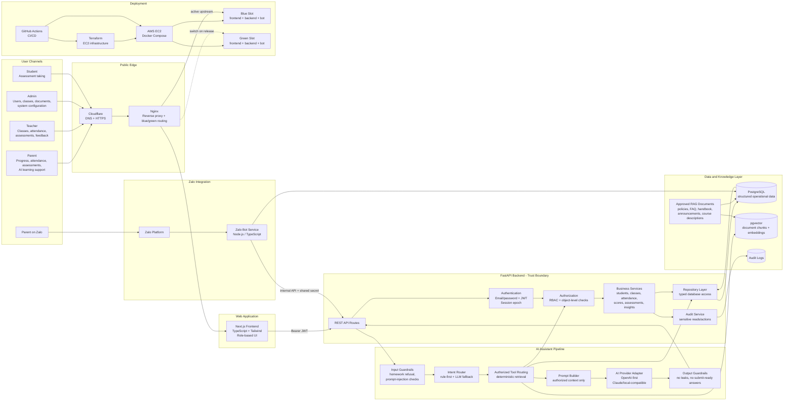

# C2-APP-129 Product Architecture Diagram

## Key Reading Notes

- The **FastAPI backend is the trust boundary**. It authenticates users, enforces RBAC and validates object-level access before any data retrieval or AI call.
- The **LLM never accesses PostgreSQL directly** and never decides permissions.
- **Structured student data** comes from PostgreSQL through repositories/services.
- **RAG is only for approved unstructured documents** such as policies, FAQ, handbook, announcements and course descriptions.
- The **Zalo bot service** is separate because channel/session handling is operationally different from the core web application.
- The current deployment model uses **AWS EC2 + Docker Compose + Nginx blue/green routing**, which is practical for MVP and can later evolve to managed PostgreSQL and ECS/Fargate.

